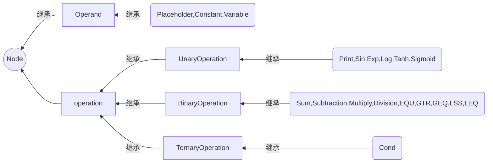

# 使用说明

## 1. Node类 （如果只是使用这个库，请直接看 2）

### 1.1 结构说明
Node类有三(四)级继承关系：（如图,装了mermaid插件就能看见了:)）
+ 基类Node类是一个抽象类
+ Operand类、Operation类继承自Node类
+ UnaryOperation类、BinaryOperation类、TernaryOperation类继承字Operation类
+ 具体的计算节点类都继承自以上类
  + Placeholder类、Constant类、Variable类继承自Operand类
  + Print类和单变量函数节点类都继承自UnaryOperation类
  + 双变量函数（四则运算和比较运算）节点类继承自TwoParentNode类
  + Cond节点类继承自threeParentNode类



<br/>


注：计算图不是一棵树，但以下内容中使用：  
 &nbsp;  &nbsp;  &nbsp; “父节点”——指代一个运算节点依赖的操作数节点  
 &nbsp;  &nbsp;  &nbsp; “子节点”——指代依赖于这个节点的运算节点
 
### 1.2 封装与接口
#### 1.2.1 基类Node类(定义于node.h,实现在node.cpp)
   + 数据成员vector<Node*> parents 和 vector<Node*> sons：用于存储父节点和子节点（图的计算关系）
   + float tempeval 和 bool calculated ：用于避免重复计算 
   + float tempderivative 和 bool calculatedderivative ：用于避免重复计算 

  ***
   + setValue() ：只用于给Placeholder和Variable赋值
   + getValue() ：用于获取该节点的计算结果，先判断此节点是否已计算过，未计算则调用func()，否则返回tempeval
   + reset() ：用于清除上一次计算结果，将节点设为“未计算状态”；并会调用父节点的reset()递归地清除当前节点计算依赖的所有的节点
   + derivative(),derivative1(),derivative2():存储导函数
   + lookupderivative(Node* p): 求关于p的导数
   + getderivative(Node* f):求f关于该节点的导数
 

<br/>
   

#### 1.2.2 Node类的4个派生类(定义于node.h,实现在node.cpp)
#### 1.2.2.1 Operation类
  + func() ：纯虚函数，供getValue()调用，由具体的派生类来实现具体计算
##### *1.2.2.1.1 UnaryOperation类、BinaryOperation类、TernaryOperation类*
  提供了构造接口（以指定数量的父节点指针作为参数来构造）供具体的派生类使用： 

  + UnaryOperation(Node* p1)   

  + BinaryOperation(Node* p1,Node* p2) 

  + TernaryOperation(Node* p1,Node* p2,Node* p3)

  UnaryOperation类、BinaryOperation类增加了导函数

  + derivative()
  + derivative1(),derivative2()
  
<br/>

#### *1.2.2.2 Operand类*
Operand类比较特殊，本身只代表数值，不涉及计算，因此添加了protected成员变量value，并用空函数重写覆盖了func()；没有统一的构造函数

<br/>

#### 1.2.3 底层派生类
#### *1.2.3.1 UnaryOperation类、BinaryOperation类、TernaryOperation类的派生类*  
（定义于onepn.h,twopn.h,threepn.h；实现于相应的.cpp文件中）  

根据父节点数沿用基类的**构造函数**，并重写覆盖**func()函数**实现特定计算。  
下面给出了在twopn.h中添加新类的派生类  

```C++
class Pow:public BinaryOperation
{  
	public:
		using BinaryOperation::BinaryOperation;
		float func(float x,float y)
		{
			return std::pow(x,y);
		}
};
```  
<br/>

#### *1.2.3.2 Operand类的派生类*    
（定义于zeropn.h；实现于相应的zero.cpp文件中）  
具体实现setValue()，重写覆盖getValue()和reset()

  
  <br/>

  ## 2. Graph类的封装与接口
  ### 2.1. Graph类的使用
  + map\<string,Node*> nodes用于存储所有节点，节点间的计算关系保存在节点（见Node类的介绍）
  
  
  + 用map\<int,float> outvalue储存eval的结果  
  + pushNode(string str,Node* newnode) (private成员) 
  &nbsp; 向计算图中加入新节点  
  
  + []下标运算符（private成员）  
  &nbsp; 用节点名称（string）访问图中节点
  ---
  + Graph()  
&nbsp;构造函数，用于新建计算图  

  + ~Graph()  
&nbsp;析构函数，释放Node空间  

  + newnode(string name, string type ...)&nbsp;  
  接受字符串参数，向Graph中加入新节点。  
  使用方法：  
  第一个参数为新节点的名字；
  第二个参数为新节点的类型，也以字符串形式传入（可以识别的字符串依据需求文档而定）
  后面的参数为新建的节点所依赖的节点的名称（对于Constant和Variable，第三个参数是初始值；Placeholder没有第三个参数）
  <br/>  

  注：1. 这些函数可以用va_list实现，但不够安全，不如重载；  
  &nbsp;  &nbsp;  &nbsp;  2. 采用这种传参方式是为了隐藏Node类
  &nbsp;  &nbsp;  &nbsp;  3.具体实现可见2.2


  + reset(string nodename)  
  &nbsp; 将某个节点以及它依赖的节点全部设置为“未计算”状态，每次eval前调用  
  + eval ( std::string nodename, const std::map\<std::string,float> &phMap)   
  &nbsp;传入节点名称和Placeholder列表（map），计算结果
  + getderivative ( std::string name1,std::string name2, const std::map\<std::string,float> &phMap)   
  &nbsp;传入节点名称和Placeholder列表（map），计算name2关于name1的导数
  + void setVariable(std::string vname, float value)  
  &nbsp; 将名称为vname的Variable的值设为value
  + float lookupanswer(int t)  
  &nbsp; 返回第t个操作的结果
  + void setAnswer(string vname,int t)
  &nbsp; 将名称为vname的Variable的设为第t个操作的结果


### 2.2. NodeFactory类  
为了避免将Node的创建从Graph类中分离（Graph类只负责对图的操作和维护），我们采用了简单工厂模式，隐藏了各类Node的具体创建过程。NodeFactory中重载了多个createNode函数用于根据参数创建Node。简单工厂模式不能满足开闭原则，但是为了避免代码（各种类）过于复杂，我们没有采用其他创建模式。  

注：简单工厂模式无法“热插拔”，添加Node的新派生类以后，需要在NodeFactory的createNode函数中修改原程序。（如果没有加入奇怪的东西的话应该只要添加一到二行代码）