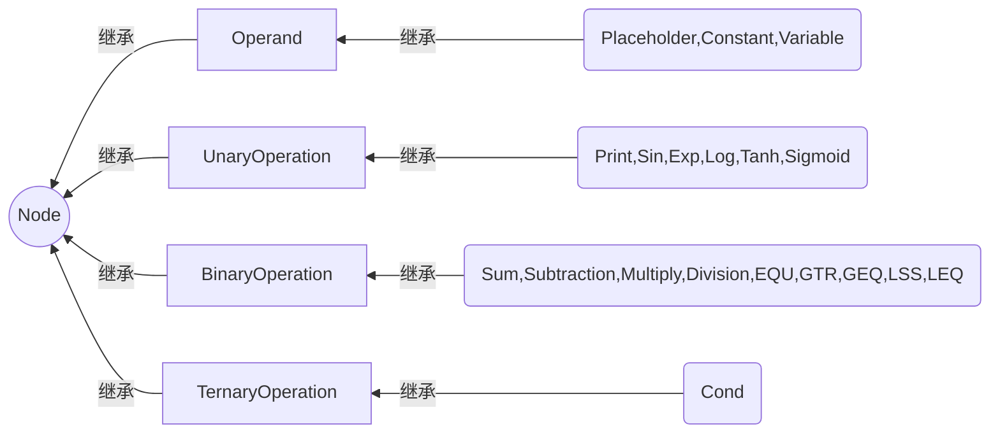

# 使用说明

## 1. Node类 （如果只是使用这个库，请直接看 2）

### 1.1 结构说明
Node类有三级继承关系：（如图,装了mermaid插件就能看见了:)）
+ 基类Node类是一个抽象类
+ Operand类、UnaryOperation类、BinaryOperation类、TernaryOperation类继承自Node类
+ 具体的计算节点类都继承自以上四个类
  + Placeholder类、Constant类、Variable类继承自Operand类
  + Print类和单变量函数节点类都继承自UnaryOperation类
  + 双变量函数（四则运算和比较运算）节点类继承自TwoParentNode类
  + Cond节点类继承自threeParentNode类



<br/>

### 1.2 封装与接口
#### 1.2.1 基类Node类(定义于node.h,实现在node.cpp)
   + 数据成员vector<Node*> parents 和 vector<Node*> sons：用于存储父节点和子节点（图的计算关系）
   + float tempeval 和 bool calculated ：用于避免重复计算 
   + float tempderivative 和 bool calculatedderivative ：用于避免重复计算 

  ***

   + getValue() ：用于获取该节点的计算结果，先判断此节点是否已计算过，未计算则调用func()，否则返回tempeval
   + reset() ：用于清除上一次计算结果，将节点设为“未计算状态”；并会调用父节点的reset()递归地清除当前节点计算依赖的所有的节点
   + setValue() ：只用于给Placeholder和Variable赋值
   + func() ：纯虚函数，供getValue()调用，由具体的派生类来实现具体计算
   + derivative(),derivative1(),derivative2():存储导函数
   + lookupderivative(Node* p): 求关于p的导数
   + getderivative(Node* f):求f关于该节点的导数
 

<br/>
   

#### 1.2.2 Node类的4个派生类(定义于node.h,实现在node.cpp)
#### *1.2.2.1 UnaryOperation类、BinaryOperation类、TernaryOperation类*
  提供了构造接口（以指定数量的父节点指针作为参数来构造）供具体的派生类使用： 

  UnaryOperation(Node* p1)   

  BinaryOperation(Node* p1,Node* p2) 

  TernaryOperation(Node* p1,Node* p2,Node* p3)
  
<br/>

#### *1.2.2.2 Operand类*
Operand类比较特殊，本身只代表数值，不涉及计算，因此添加了protected成员变量value，并用空函数重写覆盖了func()；没有统一的构造函数

<br/>

#### 1.2.3 底层派生类
#### *1.2.3.1 UnaryOperation类、BinaryOperation类、TernaryOperation类的派生类*  
（定义于onepn.h,twopn.h,threepn.h；实现于相应的.cpp文件中）  

根据父节点数沿用基类的**构造函数**，并重写覆盖**func()函数**实现特定计算。  
下面给出了在twopn.h中添加新类的派生类  

```C++
class Pow:public BinaryOperation
{  
	public:
		using BinaryOperation::BinaryOperation;
		float func(float x,float y)
		{
			return std::pow(x,y);
		}
};
```  
<br/>

#### *1.2.3.2 Operand类的派生类*    
（定义于zeropn.h；实现于相应的zero.cpp文件中）  
具体实现setValue()，重写覆盖getValue()和reset()

  
  <br/>

  ## 2. Graph类的封装与接口（库的使用）
  + map\<string,Node*> nodes用于存储所有节点，节点间的计算关系保存在节点（见Node类的介绍）
  + 用map\<int,float> outvalue储存eval的结果
  ---
  + Graph()  
&nbsp;构造函数，用于新建计算图  


  + []下标运算符  
  &nbsp; 用节点名称（string）访问图中节点

  + pushNode(string str,Node* newnode)  
  &nbsp; 向计算图中加入新节点  

  + reset(string nodename)  
  &nbsp; 将某个节点以及它依赖的节点全部设置为“未计算”状态  
  + eval ( std::string nodename, const std::map\<std::string,float> &phMap)   
  &nbsp;传入节点名称和Placeholder列表（map），计算结果
  + getderivative ( std::string name1,std::string name2, const std::map\<std::string,float> &phMap)   
  &nbsp;传入节点名称和Placeholder列表（map），计算name2关于name1的导数
  + void setVariable(std::string vname, float value)  
  &nbsp; 将名称为vname的Variable的值设为value
  + float lookupanswer(int t)  
  &nbsp; 返回第t个操作的结果
  + void setAnswer(string vname,int t)
  &nbsp; 将名称为vname的Variable的设为第t个操作的结果