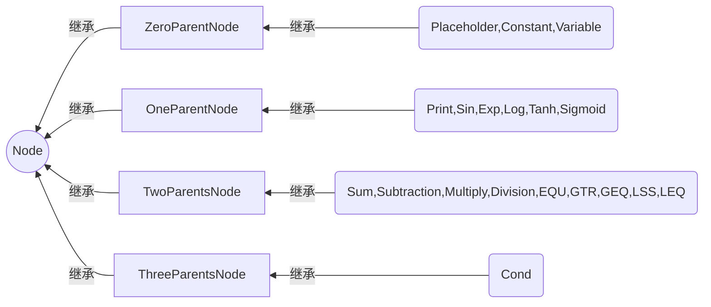

# 使用说明

## 1. Node类

### 1.1 结构说明
Node类有三级继承关系：
+ 基类Node类是一个抽象类
+ ZeroParentNode类、OneParentNode类、TwoParentsNode类、ThreeParentsNode类继承自Node类
+ 具体的计算节点类都继承自以上四个类
  + Placeholder类、Constant类、Variable类继承自ZeroParentNode类
  + Print类和单变量函数节点类都继承自OneParentNode类
  + 双变量函数（四则运算和比较运算）节点类继承自TwoParentNode类
  + Cond节点类继承自threeParentNode类

如（这张看瞎眼的）图

### 1.2 封装与接口
#### 1.2.1 基类Node类
   + geteval() 接口用于获取该节点的计算结果（纯虚函数）
   + reset() 用于清除上一次计算结果，将节点设为“未计算状态”
   + setvalue() 只用于给Placeholder和Variable赋值
   + func() 
   + protected数据成员vector<Node*> parents 和 vector<Node*> sons用于存储父节点和子节点（图的计算关系）
   + float tempeval 和 bool calculated 用于避免重复计算

#### 1.2.2 di'er